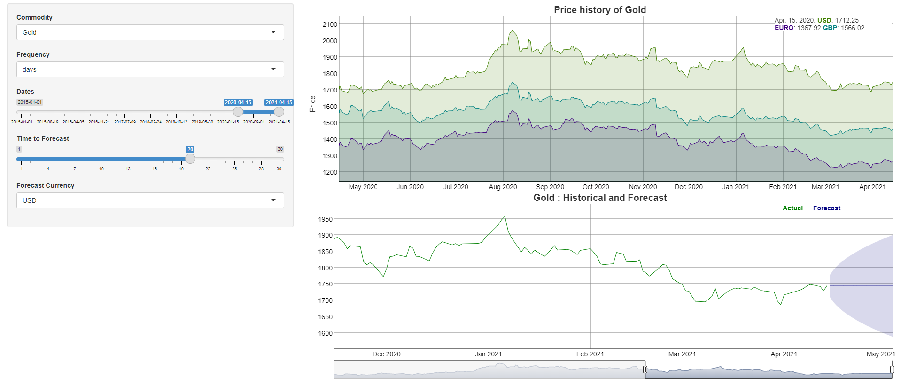

```{r setup, include=FALSE}
knitr::opts_chunk$set(echo = TRUE)
```

## Commodity Price Analysis

The aim of this project is analyzing and forecasting the the Commodity price(Gold,Sliver,Platinum,Palladium)

The user can select the commodity and data can be displayed daily,weekly and monthly with in given time period and the interactive plot presents the price in USD,EURO and GBP.

The price of the commodities are forecasting with in given forecasting time range and forecasting currency also can be selected by the user.

## Run Application

Required library to run the application

```{r eval=FALSE}
 require(Quandl)
 require(forecast)
 require(dygraphs)
 require(shiny)

```

To run the application

```{r eval=FALSE}
runGitHub("commodity","thilipra" )
```



## Functions

commoditySummary(commodity,startDate,endDate)

Get the summary value of the commodity in the certain based on the user input  
summary details are minimum value , 1st quarter ,median ,mean , 3rd quarter and maximum value

user input  
commodity : one of these Gold,Sliver,Platinum,Palladium  
startDate : Date in YYYY-MM-DD format , Default value is one year before from the current date  
endDate :Date in YYYY-MM-DD format , Default value is current date

examples:

```{r eval=FALSE}
commoditySummary("gold")
commoditySummary("Sliver","2020-01-01","2021-01-01")

```

output

```{r echo=FALSE, message=FALSE, , echo=FALSE}
source("getSummary.R", local = knitr::knit_global())
commoditySummary("gold")
```

setApiKey(key)

Store the Quandl API Key in global option.  
if API key is not valid then rise the error message.  
The Quandl R package is free. you will need to create a free Quandl account and set your API key.  
If you would like to make more than 50 calls a day.

## Dataset

[Quanld](https://www.quandl.com/) - The premier source for financial, economic, and alternative datasets, serving investment professionals.
