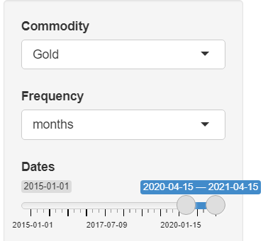
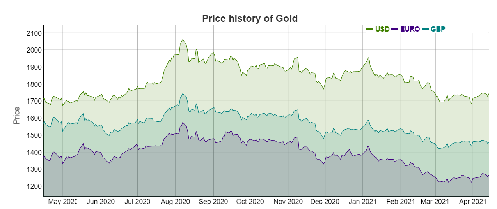
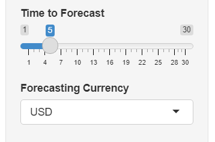
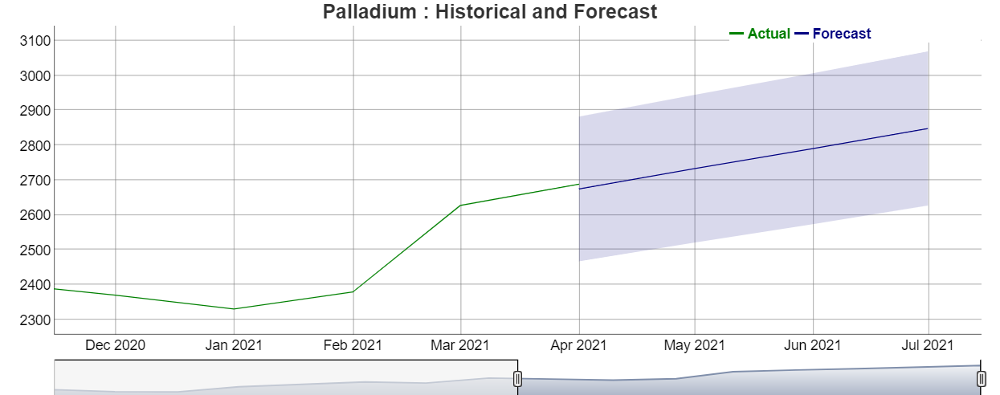

## Commodity Price Analysis

-   The aim of this project is analyzing and forecasting the the
    Commodity price(Gold,Sliver,Platinum,Palladium)

-   The user can select the commodity and data can be displayed
    daily,weekly and monthly with in given time period and the
    interactive plot presents the price in USD,EURO and GBP.

-   The price of the commodities are forecasting with in given
    forecasting time range and forecasting currency also can be selected
    by the user.

## Run Application

Required library to run the application

     require(Quandl)
     require(forecast)
     require(dygraphs)
     require(Rcpp)
     require(shiny)

To run the application

    runGitHub("commodity","thilipra" )

User can select Commodity type ,time period and time frequency (daily ,
weekly , monthly) .  
Based on those input it will display historical price graph in major
currencies (USD , EURO and GBP)

To Forecast the commodity price user can select required time period and
the currency

## Functions

**commoditySummary(commodity,startDate,endDate)**

Get the summary value of the commodity based on the user input  
summary details contains minimum value , 1st quarter ,median ,mean , 3rd
quarter and maximum value

-   User Input  
    commodity : one of these Gold,Sliver,Platinum,Palladium  
    startDate : Date in YYYY-MM-DD format , Default value is one year
    before from the current date  
    endDate :Date in YYYY-MM-DD format , Default value is current date

-   examples

<!-- -->

    commoditySummary("gold")
    commoditySummary("Sliver","2020-01-01","2021-01-01")

-   output

<!-- -->

    ##      Index                 USD            EURO           GBP      
    ##  Min.   :2020-04-15   Min.   :1673   Min.   :1223   Min.   :1420  
    ##  1st Qu.:2020-07-15   1st Qu.:1736   1st Qu.:1354   1st Qu.:1520  
    ##  Median :2020-10-13   Median :1835   Median :1399   Median :1569  
    ##  Mean   :2020-10-13   Mean   :1828   Mean   :1394   Mean   :1562  
    ##  3rd Qu.:2021-01-13   3rd Qu.:1897   3rd Qu.:1462   3rd Qu.:1615  
    ##  Max.   :2021-04-14   Max.   :2062   Max.   :1574   Max.   :1744

**setApiKey(key)**

Store the Quandl API Key in global option.  
if API key is valid return true otherwise rise the error message.  
The Quandl R package is free. you will need to create a free Quandl
account and set your API key.  
If you would like to make more than 50 calls a day.

-   example

        setApiKey("dsZGE2bdQS6oKGoYLjdt")

## Dataset

[Quanld](https://www.quandl.com/) - The premier source for financial,
economic, and alternative datasets, serving investment professionals.
